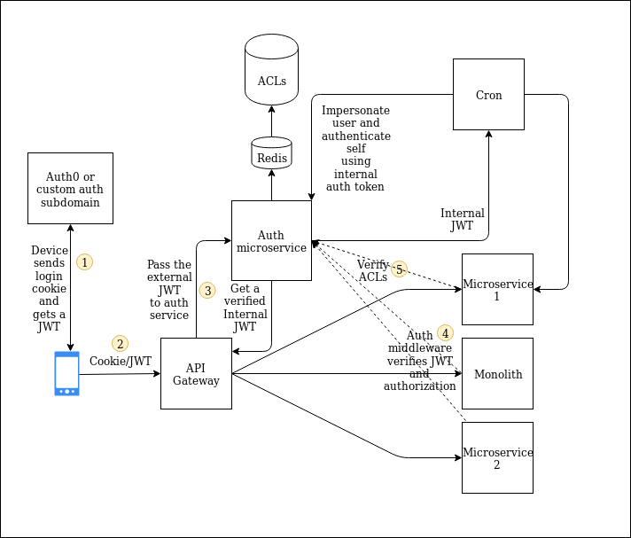

#### The Mandate
An authentication + authorisation system that allows:

1. Logging in with a username/password
2. Logging in with a third party (e.g google) via OAuth and/or SAML
3. SSO across domains and subdomains
4. Efficient checking of request authorisation for both the microservcies and the monolith
5. Efficient interservice communication with the ability to easily impersonate a user from either the monolith or the microservice
6. The ability to communicate between services outside the context of a request. e.g. from an asynchronous worker or cron job

---

There are two options:
- Switch to an external provider (Auth0/Okta/Cognito). Examining Auth0 below.
  *  Now the problem with this is that user accounts may not be seamlessly importable. Using Auth0 for instance would require all users to reset their passwords unless passwords were already [bcrypt hashed](https://auth0.com/docs/users/guides/bulk-user-imports).

  *  However, this will [allow SSO](https://auth0.com/docs/sso/current) across subdomains and also sign in with Google and other identity providers.

- Roll an in-house auth system
  * This is similar to the above, but we implement ourselves SSO on our own auth subdomain - i.e., any user visiting any subdomain of the company gets redirected to auth.lildatum.com and this controls the login cookie and redirects user back to originating (sub)domain with a JWT token if logged in, else redirects to a login page and prompts for login before sending them back.

  * Subsequent requests to the server carry this JWT token to autehnticate the API call.

  * This will allow us to customise our login screens better than Auth0 does, and also users may not have to reset their passwords if hashed in an incompatible way

- For both options, a switch to JWT auth will improve speed as identities can be verified without a database lookup (see below for caveat re. authorisation). This addresses mandates 1, 2, 3.

- User authorisation is best done with custom scopes on the JWT token.
  * If the authorization is trivial, without a lot of ACLs this can be done through scopes embedded in the JWT coming through Auth0. This approach does not scale beyone very simple needs.

  * If there are hundreds of scopes or fine-grained ACLs are required then a database lookup is better. The way this happens is described below.

Process:
- An incoming request from the client - web or mobile - is sent by the reverse-proxy (acting as an API gateway) to an auth microservice. This can be done with the [auth proxy](https://docs.nginx.com/nginx/admin-guide/security-controls/configuring-subrequest-authentication/) nginx module.

- The auth microservice verifies the incoming Auth0 JWT and then does a database lookup for ACLs, or other authorisation parmeters.

- All these authorisation parameters are then coded into an internal auth header - maybe a JWT or a simple JSON string.

- The API gateway strips the JWT out of the request, puts the user string returned by the auth microservice onto the request header and forwards it onwards

- If the monolith or a microservice gets the request, it verifies the ACLs allow access, and if so, processes it. This addresses mandate #4.

- If, for example, this reaches the monolith and it needs to access a microservice to fulfill its business logic, it simply crafts a new request, appends the internal auth header, and sends it off to the microservice. This addresses mandate #5.

- If an out-of-band service - maybe a cron job - needs to impersonate a user it simply makes a request to the auth microservice and gets an internal auth token for that user. The servers must have an internal token based auth for talking to each other and the auth service must also be secured with AWS security groups or network policies. This addresses mandate #6.

Additional notes:
1. User impersonation may be a good idea from the programming convenience viewpoint - however, it might have implications for audits, for tracing requests from point of origin to time of processing, and for logging. It may not be a good idea to treat user-originating requests on par with system-originating requests, although this is a matter of debate - this issue certainly warrants discussion.

2. This two-domain system helps ensure we don't leak information about our scopes, etc. outside the organisation.

3. [Vouch-proxy](https://github.com/vouch/vouch-proxy) can perform the role of the auth provider.

4. This involves a separate network request for each incoming request. It also involves a database lookup (i.e., for the ACLs). This latter one can be cached with Redis, this is an ideal place for Redis to improve performance.

5. This can extend auth to cover future developments - for example, if a public API is an offering then this same auth proxy can handle authentication in that system as well.